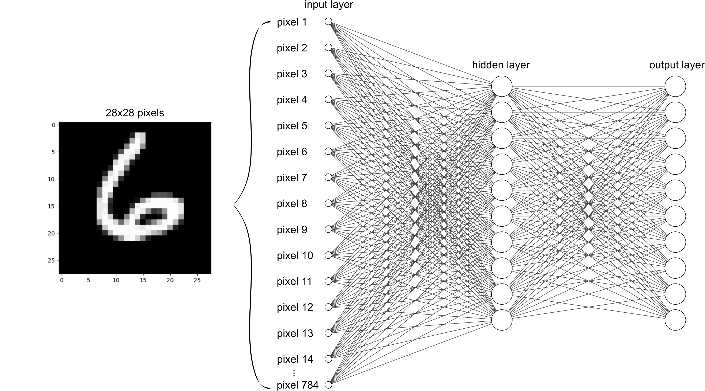

# MNIST Digit Prediction with Simple Neural Network

This project implements a simple neural network to classify digits from the [MNIST database](https://yann.lecun.com/exdb/mnist/) and fashion clothes from [Fashion-MNIST](https://github.com/zalandoresearch/fashion-mnist). 



>[!NOTE]
>The model consists of three layers (input, hidden and output) and was built *from scratch* without using any machine learning framework.

## Usage
This repository contains scripts to train, evaluate, and visualize a neural network using MNIST and Fashion-MNIST datasets. 

### Installing and Configuring

```bash 
# clone this repository 
git clone https://github.com/inteligencia-nao-artificial-INA/MNIST.git
cd MNIST

# create conda environment
conda env create -n MNIST -f environment.yml

# activating environment
conda activate MNIST
```

### Training the Neural Network
To train the neural network, run [src/train.py](src/train.py)

````bash
# usage
python src/train.py -dataset <dataset_name> -lr/--learning_rate <learning_rate> -i/--iterations <iterations>

# to train a model to predict handwritten digits using a learning rate of 0.1 and 1000 iterations
python src/train.py -dataset mnist -lr 0.1 -i 1000
````

### Evaluating the Neural Network
To evaluate the trained neural network, run [src/eval.py](src/eval.py)

````bash
# usage
python src/eval.py -dataset <dataset_name> -predictions <predictions>

# to evaluate the previous mnist model trained using a learning rate of 0.1 and 1000 iterations
python src/eval.py -dataset mnist -predictions 10
````

### Visualizing Model Activations
To visualize the neural network activations, run [src/visualize.py](src/visualize.py)

````bash
# usage
python src/visualize.py -dataset <dataset_name>

# to visualize node activation from the previous mnist model trained using a learning rate of 0.1 and 1000 iterations
python src/visualize.py -dataset mnist
````

## Model Architecture
* Layer 0 (input layer): A vector with 784 features (28x28 pixels) 
* Layer 1 (hidden layer): A fully connected layer with 10 nodes, taking in the input vector
* Layer 2 (output layer): Another fully connected layer with 10 nodes, representing the 10 digit classes (0-9).

### Parameter Initialization
The weights and biases for layers 1 and 2 are initialized randomly with small values.

>[!NOTE]
>This ensures that the model starts with a diverse set of parameters, which is crucial for effective learning during training

### Activation Function
The [ReLU (Rectified Linear Unit)](https://en.wikipedia.org/wiki/Rectifier_(neural_networks)) activation function is used in the first layer to introduce non-linearity, enabling the network to learn more complex patterns. In the final layer, [softmax function](https://en.wikipedia.org/wiki/Softmax_function#:~:text=The%20softmax%20function%2C%20also%20known,used%20in%20multinomial%20logistic%20regression.) converts the raw scores into a probability distribution.

### Forward Propagation
Data passes through the network in two stages: first, a linear combination of inputs and weights is calculated, followed by a ReLU activation in the first layer. The second layer uses the softmax function to output probabilities for each digit class.

### Backpropagation
Backpropagation is employed to adjust the weights and biases by computing the gradient of the loss with respect to each parameter. The model uses these gradients to update the parameters and reduce the overall prediction error.

### Optimization
The model is optimized using [gradient descent](https://en.wikipedia.org/wiki/Gradient_descent), with a learning rate that controls the speed of convergence. The training is run for a set number of iterations to progressively minimize the loss.

## Results
After training for 1000 iterations and using learning rate of 0.1, the model achieved an accuracy of `88.1%` on the training dataset and `88%` on the validation set.

````bash
# training
python src/train.py -dataset mnist -lr 0.1 -i 1000
Iteration:  990
Accuracy: 88.1056%

# evaluating
python src/eval.py -dataset mnist -predictions 10
Parameters loaded from model/mnist/nn_parameters.npz
Accuracy: 88.0500%
````

## Future Improvements
* Experiment with different hyperparameters (learning rate, number of nodes)
* Apply regularization techniques to avoid overfitting
* Test alternative loss functions for potentially better convergence
* Explore deeper architectures by adding more layers for improved accuracy
